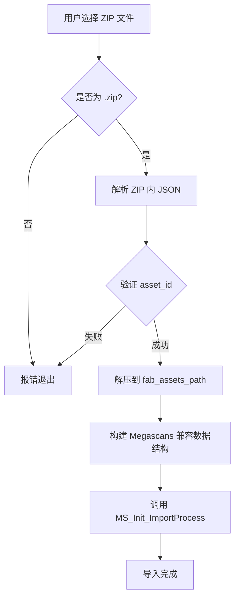
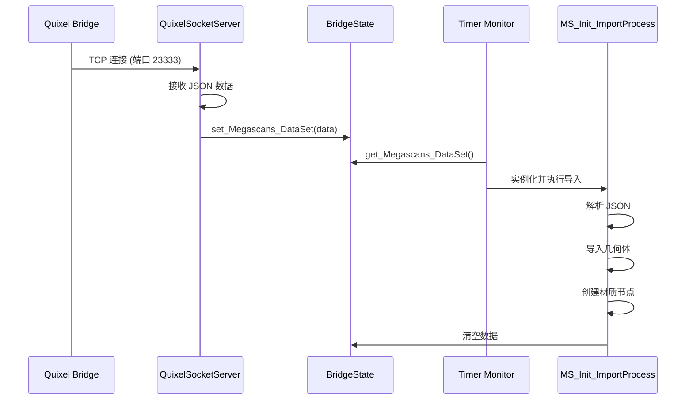
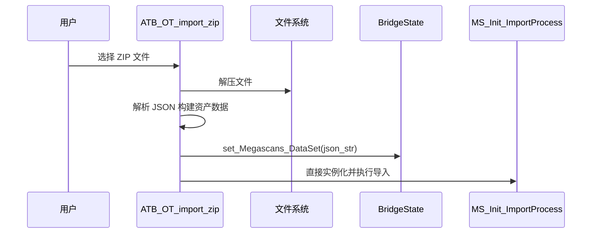

# ATBridge 插件代码分析文档

> 本文档是对 ATBridge Blender 插件的完整代码分析，包括项目结构、功能模块、代码健壮度评估，以及重构建议。供后续修改和重构时参考。

---

## 1. 项目概述

**ATBridge** 是一个 Blender 插件，主要功能包括：

1. **Quixel Bridge 实时导入** - 通过 Socket 通信接收 Megascans 资产并自动导入
2. **Fab ZIP 文件导入** - 解压并导入 Fab 商城的 ZIP 资产包
3. **多语言支持** - 中英文 UI 翻译系统
4. **材质自动构建** - PBR 工作流材质节点自动搭建

**版本信息**：
- 当前版本：0.2.7
- 声明的 Blender 支持版本：2.80+（实际已针对 4.x 做了兼容）

---

## 2. 项目目录结构

```
ATBridge/
├── __init__.py              # 插件入口与注册
├── ATBridge.py              # 核心桥接逻辑 (841 行)
├── ATBridgeExtend.py        # 扩展功能 - Fab ZIP 导入 (253 行)
├── README.md                # 项目说明文档
├── LICENSE                  # 许可证文件 (LGPL)
├── utils/
│   ├── __init__.py          # utils 模块初始化
│   └── translation.py       # 多语言翻译系统 (74 行)
└── docs/
    ├── atbridge-blender4x-migration-analysis.plan.md  # 4.x 迁移分析
    └── ATBridge_Code_Analysis.md                       # 本文档
```

---

## 3. 模块详解

### 3.1 `__init__.py` - 插件入口

**职责**：
- 定义 `bl_info` 插件元信息
- 注册/注销子模块
- 添加菜单项和工具栏按钮

**关键代码结构**：

| 函数/类 | 功能 |
|---------|------|
| `load_plugin()` | `@persistent` 装饰器，在文件加载后自动启动 Bridge 插件 |
| `menu_func_import()` | 在 File > Import 菜单添加 Alembic 导入选项 |
| `import_zip_button()` | 在 3D 视图头部添加 "Import Fab Asset" 按钮 |
| `register()` / `unregister()` | 标准 Blender 插件注册函数 |

---

### 3.2 `ATBridge.py` - 核心桥接逻辑

**文件规模**：841 行

#### 3.2.1 类结构

| 类名 | 行数 | 职责 |
|------|------|------|
| `BridgeState` | 13-103 | 线程安全的全局状态管理器 |
| `BridgeData` | 105-110 | 数据结构（dataclass，目前未充分使用） |
| `BridgeConfig` | 112-116 | 常量配置（HOST, PORT, BUFFER_SIZE） |
| `MS_Init_ImportProcess` | 118-680 | **核心类** - 资产导入与材质构建 |
| `QuixelSocketServer` | 685-728 | Socket 服务器线程 |
| `MS_Init_LiveLink` | 731-766 | Blender Operator - 启动 LiveLink |
| `MS_Init_Abc` | 769-809 | Blender Operator - Alembic 导入 |
| `testpreferences` | 812-816 | 遗留代码（空实现） |

#### 3.2.2 `BridgeState` 状态管理器

```python
class BridgeState:
    _lock = threading.Lock()
    _MG_AlembicPath = []
    _MG_Material = []
    _MG_ImportComplete = False
    _Megascans_DataSet = None
```

**设计模式**：使用类属性 + 类方法模拟单例，通过 `threading.Lock` 保证线程安全。

**暴露的方法**：
- `get_*/set_*` 系列：线程安全的状态读写
- `reset()`：重置所有状态
- `check_port_available()`：检测端口是否可用
- `check_quixel_bridge_connectivity()`：测试与 Bridge 的通信

#### 3.2.3 `MS_Init_ImportProcess` 核心导入类

**职责分布**（方法列表）：

| 方法 | 功能 |
|------|------|
| `__init__()` | 解析 JSON 数据，遍历资产列表 |
| `initImportProcess()` | 导入流程主控 |
| `ImportGeometry()` | 导入 FBX/OBJ/ABC 模型 |
| `CollectSelectedObjects()` | 收集选中的网格对象 |
| `ApplyMaterialToGeometry()` | 为对象赋予材质 |
| `CheckScatterAsset()` | 检测是否为散布资产 |
| `CheckIsBillboard()` | 检测是否为 Billboard LOD |
| `ScatterAssetSetup()` / `PlantAssetSetup()` | 创建 Empty 父对象 |
| `SetupMaterial()` | **核心** - 构建材质节点图 |
| `CreateMaterial()` | 创建/获取材质，初始化节点树 |
| `CreateTextureNode()` | 创建贴图节点 |
| `CreateTextureMultiplyNode()` | 创建 Color × AO 混合节点 |
| `CreateNormalNodeSetup()` | 法线/凹凸节点设置 |
| `CreateDisplacementSetup()` | 置换节点设置 |
| `GetBSDFInputName()` | 处理 Blender 4.0+ BSDF 输入名变更 |
| `GiveObjectsMaterial()` | 为 Surface/Atlas 资产赋材质 |

#### 3.2.4 `QuixelSocketServer` Socket 服务器

```python
class QuixelSocketServer(threading.Thread):
    def __init__(self, host='localhost', port=23333, importer=None):
        ...
    def run(self):
        # 监听端口，接收数据，调用 importer 回调
    def stop(self):
        # 优雅停止服务器
```

**通信协议**：
- 端口：23333（与 Quixel Bridge 约定）
- 数据格式：完整的 JSON 字符串
- 传输方式：一次连接传输一个资产包

---

### 3.3 `ATBridgeExtend.py` - Fab ZIP 导入

**文件规模**：253 行

#### 3.3.1 类结构

| 类名 | 行数 | 职责 |
|------|------|------|
| `AT_AddonPreferences` | 10-28 | 插件首选项（Fab 资产路径设置） |
| `ATB_OT_import_zip` | 31-230 | Fab ZIP 导入 Operator |

#### 3.3.2 `ATB_OT_import_zip` 工作流程



**智能文件匹配**：
- `smart_find_file(asset_id, map_name)` - 按资产ID和贴图名称匹配文件
- `smart_find_model(asset_id, mesh_format)` - 按资产ID和格式匹配模型

**贴图类型标准化**：
```python
BASECOLOR_NAMES = ["basecolor", "albedo", "diffuse", "col", "color"]
# 统一转换为 "albedo"
```

---

### 3.4 `utils/translation.py` - 多语言系统

**文件规模**：74 行

**设计模式**：简单的键值对翻译表 + 语言检测

```python
class ATBridgeTranslationManager:
    def _load_translations(self):
        return {
            "Import Fab Asset": {"en_US": "Import Fab Asset", "zh": "导入Fab资产"},
            ...
        }
    
    def get_text(self, key, context=None):
        # 根据 context.preferences.view.language 返回对应翻译
```

**便捷函数**：
- `get_text(key, context)` - 获取翻译文本
- `add_translation(key, en_text, zh_text)` - 动态添加翻译

---

## 4. 数据流与调用链

### 4.1 Quixel Bridge 实时导入流程



### 4.2 Fab ZIP 导入流程



---

## 5. 代码健壮度评估

### 5.1 优点 ✅

| 方面 | 描述 |
|------|------|
| **线程安全** | `BridgeState` 使用 `threading.Lock` 保护共享状态 |
| **版本兼容** | 针对 Blender 2.92/3.3/3.4/4.0/5.0 的 API 变更做了适配 |
| **错误日志** | 大量 `print()` 语句便于调试 |
| **模块化入口** | 清晰的 `register()`/`unregister()` 结构 |
| **智能文件匹配** | Fab 导入的文件匹配算法考虑了多种命名情况 |

### 5.2 问题与风险 ⚠️

#### 5.2.1 架构层面问题

| 问题 | 严重度 | 描述 |
|------|--------|------|
| **单类职责过重** | 高 | `MS_Init_ImportProcess` 包含 560+ 行代码，负责解析、导入、材质构建等多种职责 |
| **全局状态模式** | 中 | `BridgeState` 作为全局单例，难以支持并发导入 |
| **硬编码常量** | 中 | 端口 23333、默认路径 "D:/FabAssets" 等 |
| **遗留代码** | 低 | `testpreferences` 类、注释掉的大块代码 |

#### 5.2.2 代码质量问题

| 问题 | 位置 | 描述 |
|------|------|------|
| **宽泛异常捕获** | 多处 | `except Exception as e: print(...)` 或 `except: pass` |
| **静默失败** | `ATBridgeExtend.py:218` | `get_fab_assets_path()` 中的 `except: pass` |
| **缺少类型注解** | 全局 | Python 类型提示不完整 |
| **魔法数字** | 多处 | 如 `self.IOR = 1.45`、`displacementNode.inputs[2].default_value = 0.1` |
| **Context 依赖** | 全局 | 直接使用 `bpy.context` 而非 Operator 传入的 context |

#### 5.2.3 Blender API 使用问题

| 问题 | 位置 | 描述 |
|------|------|------|
| **属性注解** | `ATBridgeExtend.py:19,36` | 使用 `# type: ignore` 抑制类型检查 |
| **节点索引** | 多处 | 部分位置仍使用数字索引（如 `inputs[2]`）而非名称 |
| **bl_idname 格式** | `ATBridge.py:770` | `MS_Init_Abc` 的 `bl_idname = "ms_livelink_abc.py"` 包含文件扩展名 |

### 5.3 量化评分

| 维度 | 评分 (1-10) | 说明 |
|------|-------------|------|
| **功能完整性** | 8 | 核心功能完善，支持多种资产类型 |
| **代码组织** | 5 | 单文件过大，职责划分不清 |
| **错误处理** | 4 | 异常捕获过于宽泛，缺少用户友好提示 |
| **可维护性** | 5 | 版本兼容代码分散，难以统一管理 |
| **可测试性** | 3 | 缺少单元测试，高度依赖 Blender 运行时 |
| **文档注释** | 4 | 有基础注释，但缺少 docstring 和类型提示 |

**综合评分**：**5.0 / 10**

---

## 6. 重构建议

### 6.1 短期改进（低风险）

1. **统一异常处理**
   ```python
   # 建议：创建统一的日志/报告工具
   def report_error(operator, error, user_message=None):
       print(f"[ATBridge] Error: {error}")
       traceback.print_exc()
       if operator and user_message:
           operator.report({'ERROR'}, user_message)
   ```

2. **提取配置常量**
   ```python
   # 建议：在 BridgeConfig 中统一管理
   class BridgeConfig:
       HOST = 'localhost'
       PORT = 23333
       DEFAULT_IOR = 1.45
       DISPLACEMENT_SCALE = 0.1
       DEFAULT_FAB_PATH = ""  # 空值，强制用户设置
   ```

3. **清理遗留代码**
   - 删除 `testpreferences` 类
   - 删除注释掉的旧版本兼容代码
   - 修复 `MS_Init_Abc.bl_idname` 格式

### 6.2 中期改进（中等风险）

1. **拆分 `MS_Init_ImportProcess`**
   ```
   ├── asset_parser.py      # JSON 解析与数据准备
   ├── geometry_importer.py # FBX/OBJ/ABC 导入
   ├── material_builder.py  # 材质与节点构建
   └── node_helpers.py      # 节点创建辅助函数
   ```

2. **版本兼容层**
   ```python
   # 建议：集中管理版本特定逻辑
   class BlenderCompat:
       @staticmethod
       def get_mix_node_type():
           return 'ShaderNodeMix' if bpy.app.version >= (3, 4, 0) else 'ShaderNodeMixRGB'
       
       @staticmethod
       def get_bsdf_input(input_type):
           mapping = {
               'specular': 'Specular IOR Level' if bpy.app.version >= (4, 0, 0) else 'Specular',
               ...
           }
           return mapping.get(input_type, input_type)
   ```

3. **导入任务队列**
   ```python
   # 建议：用任务对象替代全局状态
   @dataclass
   class ImportJob:
       id: str
       data: dict
       status: str = 'pending'
       result: Optional[dict] = None
   
   class ImportQueue:
       def __init__(self):
           self._queue = Queue()
           self._lock = threading.Lock()
       
       def enqueue(self, job: ImportJob): ...
       def process_next(self) -> Optional[ImportJob]: ...
   ```

### 6.3 长期改进（需仔细规划）

1. **仅支持 Blender 4.x+**
   - 更新 `bl_info["blender"]` 为 `(4, 0, 0)`
   - 删除所有 `< 4.0` 的版本分支
   - 参考 `docs/atbridge-blender4x-migration-analysis.plan.md`

2. **添加单元测试**
   - 使用 `fake-bpy-module` 进行离线测试
   - 针对 JSON 解析、文件匹配等纯函数编写测试

3. **配置持久化**
   - 使用 Blender 的 `PropertyGroup` 保存用户配置
   - 支持首选项中配置端口号

---

## 7. 文件变更优先级

| 优先级 | 文件 | 改进内容 |
|--------|------|----------|
| P0 | `ATBridge.py` | 异常处理、删除遗留代码、修复 bl_idname |
| P1 | `ATBridge.py` | 拆分 `MS_Init_ImportProcess` |
| P1 | `ATBridgeExtend.py` | 修复静默异常、改进默认路径 |
| P2 | `__init__.py` | 更新版本声明 |
| P2 | `utils/` | 扩展翻译覆盖范围 |
| P3 | 新增 | 版本兼容层模块 |
| P3 | 新增 | 测试框架 |

---

## 8. 附录

### 8.1 关键依赖

| 依赖 | 用途 |
|------|------|
| `bpy` | Blender Python API |
| `socket` | TCP 通信（Quixel Bridge） |
| `threading` | 后台 Socket 服务器 |
| `json` | 资产数据解析 |
| `zipfile` | Fab ZIP 解压 |
| `dataclasses` | 数据结构定义 |

### 8.2 相关文档

- [atbridge-blender4x-migration-analysis.plan.md](file:///d:/NextCloud/Code/Python/Baka%20Akari%20Tools%20Bag/ATBridge/docs/atbridge-blender4x-migration-analysis.plan.md) - Blender 4.x 迁移分析
- [Quixel Bridge LiveLink Documentation](https://docs.quixel.org/bridge/livelinks/blender/info_quickstart.html)

---

*文档生成时间：2026-02-05*
*插件版本：0.2.7*
